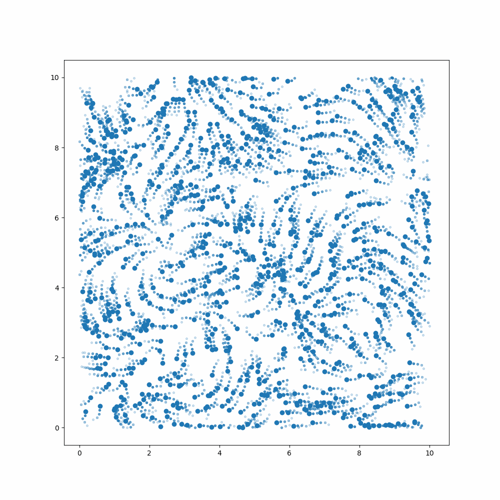

# Vicsek Model Simulator

The [Vicsek Model](https://en.wikipedia.org/wiki/Vicsek_model) is mathematical model that can be used to describe moving particles. 
It is of relevance for many sciences like physics, biology, ecology or social sciences, as it can be used to model particles, animal swarms or even people flows.
This simulator uses the [minimal implementation of the Vicsek](https://gist.github.com/arshednabeel/a70cc117eb38899fdd138f48b0bc5cd2) by [Arshed Nabeel](https://gist.github.com/arshednabeel).
You can play with the parameters to see how they affect the model.

Visit the Website: https://vicseksim.streamlit.app/

Example

